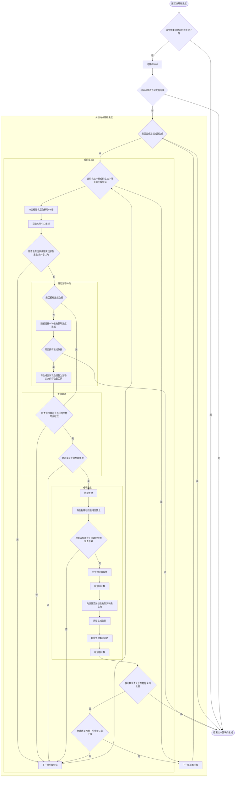

[TOC]

> 写文章时最新的稳定版游戏版本：1.16.4（指Minecraft Java版，不保证向前及向后的版本兼容性
>
> 本文主要涉及的文件：`net/minecraft/world/level/NaturalSpawner.java`

成群生成（Pack Spawning），是Minecraft中自然生成生物的机制。这里说的生成机制，不仅包含了刷怪机制，也包含了生成动物的机制，并同时包含了水中与陆上的生成，但是也仅限于自然生成的机制，即，像地狱传送门方块生成猪人、玩家不睡觉生成幻翼等，与本文所介绍内容无关。另外，篇幅所限，本文对不同生物的具体生成规则不做展开说明，将其放在之后的文章中具体分析，让本文聚焦于成群生成机制的本身。

在成群生成的过程中，会有一个循环来不断移动生成的位置，所以又被称作刷怪循环或游走刷怪，它们指的都是同一个机制。

如果有仔细观察过的话会发现同种生物总是会聚在一群生成，这就是成群生成。


### 成群生成前的准备工作

构成Minecraft的最小单元是方块，但对于整个世界来说，按区块来计算要方便的多。成群生成便是以区块为单位进行的，游戏会遍历一些区块，在每个区块中随机选择一个点，开始成群生成。

会执行成群生成的区块需要满足：

- 为强加载区块
- 区块中心水平距离128内存在非旁观者模式的玩家

当游戏规则允许自然生成生物时，除动物每20秒尝试生成一次之外，在每一个游戏刻游戏都会执行成群生成来试图填满生物上限。

正因为动物的生成是每20秒尝试一次的，所以动物农场并不需要非常快速的处理，只要在下一次生成周期到来之前处死或移至下界即可，所以一般动物农场最需要的还是增加可生成面积。而更高端的做法是将处理与动物的20秒生成周期同步来提高效率，参考[BV1St41167VH](https://www.bilibili.com/video/BV1St41167VH)。

```Java
//net/minecraft/world/level/NaturalSpawner.java:L97
//每gt都会在满足要求的区块中运行（当RULE_DOMOBSPAWNING为TRUE时）
spawnForChunk(spawnState, spawnFriendlies, spawnEnemies, spawnPersistent) {
    //SPAWNING_CATEGORIES:MONSTER, CREATURE, AMBIENT, WATER_CREATURE, WATER_AMBIENT, MISC
    for (MobCategory mobCategory : SPAWNING_CATEGORIES){
        //根据游戏规则排除不可生成的生物
        //spawnPersistent = getGameTime() % 400L == 0L
        //即持久型生物每400gt生成一次
        //以及生物上限检查
        if (!spawnFriendlies && mobCategory.isFriendly() || !spawnEnemies && !mobCategory.isFriendly() || !spawnPersistent && mobCategory.isPersistent() || !spawnState.canSpawnForCategory(mobCategory)) continue;
        spawnCategoryForChunk(mobCategory, spawnPredicate/* 生成谓词，用于生成势能 */, afterSpawnCallback/* 回调函数，用于生成势能 */);
    }
}
```

#### 1.1 生物上限检查

如果安装了Carpet Mod，则可以使用`/log mobcaps ` 指令在Tab界面中显示各类生物的上限，一般都会习惯默认打开。


除去TPS/MSPT显示的第二行就是生物上限显示，可以看到，生物上限被分成了六大类，它们有各自的上限系数，根据服务器内的人数与分布算出实际上限。这些生物类别与上限系数分别为：

**怪物：70	动物：10	环境生物：15	水生动物：5	水生环境生物：20	杂项：-1**

上限并非只是简单地将玩家数乘以70，而是使用了一个公式：

```
生物上限 = 生物上限系数 × 可生成区块数 ÷ 289
```

一个玩家的可生成区块数恰好为17x17=289，也就是玩家不互相影响时，上限就是人数乘以系数，而玩家随机分布时，生物上限也常为非整数。

如果当前生物数量少于该类生物上限，那么就会对该类生物进行生成。

有意思的是，此处的可生成区块数与上述的执行自然生成的区块并不一致，它并没有排除旁观者模式的玩家。无论视距如何，每个玩家计数周围的17×17个区块，多玩家的区块重叠时不会重新计数，所以会出现一个有趣的现象，旁观者玩家不会使生物生成，但是会增加生物上限。


利用上述计算方法，我们可以在多人游戏中提高生物上限来显著增加生成效率，最简单的方法是使用旁观模式或没有处于有效生成位置的高处的玩家等：[BV1Rt411X7qa](https://www.bilibili.com/video/BV1Rt411X7qa)


```java
//net/minecraft/world/level/NaturalSpawner.java:L432
//生物上限检查
SpawnState.canSpawnForCategory(mobCategory) {
    //生物上限 = 生物上限系数 × 可生成区块数 ÷ 289
    //生物上限系数：
    //怪物：70
    //动物：10
    //环境生物：15
    //水生动物：5
    //水生环境生物：20
    //杂项：-1
    n = mobCategory.getMaxInstancesPerChunk() * spawnableChunkCount / MAGIC_NUMBER;
    //小于该类生物上限时才会生成
    return mobCategoryCounts.getInt(mobCategory) < n;
}
```


#### 1.2 选择初始点

在一个区块内，游戏会随机选择一个坐标作为成群生成的起始点，在生成循环的过程中，它会在XZ水平面上移动（所以得名生成游走），但不会改变Y值，该位置的高度即对应了实际生成时生物的脚部（当然对于是正常两格高生物来说）的位置。

```java
//net/minecraft/world/level/NaturalSpawner.java:L106
//为区块生成一个类别的生物
spawnCategoryForChunk(mobCategory, spawnPredicate, afterSpawnCallback) {
    //在区块内随机选点
    blockPos = getRandomPosWithin();
    //y0处不可生成
    if (blockPos.getY() < 1) return;
    //以该位置为起始点进行生成游走
    spawnCategoryForPosition(mobCategory, blockPos, spawnPredicate, afterSpawnCallback);
}
```

选择初始点的规则为XZ使用随机数选择，而Y值选择该XZ处最高表面方块+1至0之间的随机值。那么在随机选择Y值的过程中，最高表面方块的高度就会对生成概率产生影响，如果最高表面方块的Y值为100，而生成平台做了6层，那么初始点选在生成平台同一高度上的概率即为`6/(100+1)`，可以看出，降低y值和增加生成平台都可以有效地增加生成几率。因为y0位置是不可能生成成功的（生物连落脚点都没有），所以最高效的生成平台为y0单层方块，生物有1/2的几率选择在y1位置为初始点生成。

```Java
//net/minecraft/world/level/NaturalSpawner.java:L243
getRandomPosWithin() {
    chunkPos = levelChunk.getPos();
    //x、z取区块内随机位置
    x = chunkPos.getMinBlockX() + random(16);
    z = chunkPos.getMinBlockZ() + random(16);
    //y取最高表面方块+1至0中随机一个位置
    n = levelChunk.getHeight(Heightmap.Types.WORLD_SURFACE, x, z) + 1;
    y = random(n + 1);
    return new BlockPos(x, y, z);
}
```

### 成群生成

对于一个初始点，游戏会进行三组成群生成，每组成群生成都会以初始点为起点在水平XZ方向上各移动正负0-5格若干次来尝试生成，移动次数由该生物规定的最小群数量及最大群数量确定，默认为4次。移动的格数由两个1-6的随机数相减确定，所以会更倾向于移动较少的格数。


```java
//net/minecraft/world/level/NaturalSpawner.java:L114
//成群生成
spawnCategoryForPosition(mobCategory, blockPos, spawnPredicate, afterSpawnCallback) {
    y = blockPos.getY();
    blockState = getBlockState(blockPos);
    //初始点若为可充能方块则直接结束
    if (blockState.isRedstoneConductor(blockPos)) return;
    mutableBlockPos = new BlockPos.MutableBlockPos();
    //三次成群生成生物计数
    spawnCluster = 0;
    //进行三组生成成群生成
    block0 : for (i = 0; i < 3; ++i) {
        //每组都以选中点开始游走
        x = blockPos.getX();
        z = blockPos.getZ();
        spawnerData = null;
        spawnGroupData = null;
        //默认进行1-4次生成尝试
        spawnTries = random(4);
        //成群生成计数
        groupSize = 0;
        for (j = 0; j < spawnTries; ++j) {
            //x、z方向上正负随机移动0-5格，由两个随机数相减获得
            mutableBlockPos.set(x += random(6) - random(6), y, z += random(6) - random(6));
            //获取方块中心坐标
            xx = x + 0.5;
            zz = z + 0.5;
            //获取与玩家的距离的平方
            player = getNearestPlayer(xx, y, zz);
            distanceToSqr = player.distanceToSqr(xx, y, zz);
            //该世界没有玩家或与玩家距离不合适则进行下一次生成尝试
            if (player == null || !isRightDistanceToPlayerAndSpawnPoint(mutableBlockPos, distanceToSqr)) continue;
            //在第一次移动坐标后确定生成的生物
            if (spawnerData == null) {
                spawnerData = getRandomSpawnMobAt(structureFeatureManager, mobCategory, mutableBlockPos);
                //若这个位置的结构特征及群系没有可生成的生物则进行下一组成群生成
                if (spawnerData == null) continue block0;
                //将生成尝试次数调整为由生物定义的群数量区间之中
                spawnTries = spawnerData.minCount + random(1 + spawnerData.maxCount - spawnerData.minCount);
            }
            //检查对于该生物生成位置是否有效，并进行生成势能检查，若失败则进行下一次生成尝试
            //调用生成势能谓词：spawnState.canSpawn(entityType, blockPos)
            if (!isValidSpawnPostitionForType(mobCategory, structureFeatureManager, spawnerData, mutableBlockPos, distanceToSqr) || !spawnPredicate.test(type, mutableBlockPos)) continue;
            //创建生物
            mob = getMobForSpawn(spawnerData.type);
            if (mob == null) return;
            //把生物移动至生成位置上
            mob.moveTo(xx, y, zz, random() * 360.0f, 0.0f);
            //检查对于该生物位置是否有效，不有效则进行下一次生成尝试
            if (!NaturalSpawner.isValidPositionForMob(mob, distanceToSqr)) continue;
            //为生物设置一些属性
            spawnGroupData = mob.finalizeSpawn(getCurrentDifficultyAt(mob.blockPosition()), MobSpawnType.NATURAL, spawnGroupData);
            //增加组计数
            ++groupSize;
            //为世界添加生物及其骑乘生物
            addFreshEntityWithPassengers(mob);
            //调整生物生成后的生成势能，调用回调函数：spawnState.afterSpawn(mob)
            afterSpawnCallback.run(mob);
            //大于三次成群生成上限则结束，普通生物上限均为4
            //鱼: 8 马: 6 狼: 8 恶魂: 1 掠夺者: 1
            if (++spawnCluster >= mob.getMaxSpawnClusterSize()) return;
            //大于成群生成计数则进行下一组成群生成
            //除鱼外无区别
            if (mob.isMaxGroupSizeReached(groupSize)) continue block0;
        }
    }
}
```

#### 2.0 排除可充能方块

在循环的开始之前，除一些初始化工作之外，游戏首先会检查初始点是否为可充能方块，如果是则直接结束本区块的生成。此处可充能的方块也可以理解成口头上说的实心方块（或实体方块）。

所以说在设计刷怪塔时不要忽略与刷怪位置同一平面的可充能方块，一个就会取消整组生成尝试，会大幅降低刷怪效率。

#### 2.1 距离检查（近）

在每次移动的过程中，都会先判断相对玩家的位置，不让生物在玩家及出生点24格内生成。先前提到，自然生成只会在强加载区块中进行，所以此时的游走如果跨越区块至非强加载区块内，那么生物也不会生成。

一名玩家处于出生点附近时的怪物生成情况，其中左侧小圆为出生点为中心半径24的圆，中间小圆为以玩家为中心半径24的圆，黑色部分为怪物可生成的区域：


单人世界中将渲染距离调整至6的怪物生成情况，中间小圆为以玩家为中心半径24的圆，黑色部分为怪物可生成的区域，恰好为强加载的9x9区块：


```java
//net/minecraft/world/level/NaturalSpawner.java:L163
//距离检查
isRightDistanceToPlayerAndSpawnPoint(mutableBlockPos, distanceToSqr) {
    //距离玩家24格内不生成
    if (distanceToSqr <= 576.0) return false;
    //世界出生点24格内不生成
    if (getSharedSpawnPos().closerThan(new Vec3(mutableBlockPos.getX() + 0.5, mutableBlockPos.getY(), mutableBlockPos.getZ() + 0.5), 24.0)) return false;
    chunkPos = new ChunkPos(mutableBlockPos);
    //需要不跨区块或处于强加载区块内
    return Objects.equals(chunkPos, chunkAccess.getPos()) || serverLevel.getChunkSource().isEntityTickingChunk(chunkPos);
}
```

#### 2.2 确定生物

保证与玩家的距离之后，生物会在每组成群生成的第一次移动后根据结构特征与群系确定下来，如果第一次移动发现没有任何可生成的生物（如在蘑菇岛群系生成怪物类别），则结束这组成群生成，进行下一组生成尝试。守卫者农场的顶只需要扩展5格的原因就是初始点必须在这第一次移动的5格以内进入结构来生成守卫者。而对于通用刷怪塔等则可扩展20格，它可以最多经过四次移动再进入生成平台内。

注意此时确定生物**只会根据当前位置的结构特征与群系**，即使该点并不符合实生成要求。同时，此处也会对水生环境生物在河流群系内生成的概率进行修正，使其能获取到生物的概率仅为2%。结构特征指的是诸如女巫小屋及海底神殿等会生成特定生物的结构，它的判断优先于群系的判断。所以当位置处于结构内，则不会再获取群系中的生物列表。史莱姆在史莱姆区块的生成属于群系定义而非结构特征，除无法刷怪的所有群系都会包含史莱姆的生成列表，也就是为什么史莱姆区块中仍会生成其他怪物，而女巫小屋内不会。

此时会获取到一个生物列表，列出该类别中所有满足该结构特征或群系的生物列表以及每种生物的生成权重，不同生物在不同群系中的生成概率是不一样的，游戏会根据权重，在生物列表中随机选择一项来作为这一组成群游走的生物，那么在这组成群生成中，游戏只会尝试生成这种生物。

```java
//net/minecraft/world/level/NaturalSpawner.java:L220
//获取生物列表并随机选择一种生物
getRandomSpawnMobAt(structureFeatureManager, mobCategory, blockPos) {
    biome = getBiome(blockPos);
    //河流群系生成水生环境生物概率修正为2%
    if (mobCategory == MobCategory.WATER_AMBIENT && biome.getBiomeCategory() == Biome.BiomeCategory.RIVER && random.nextFloat() < 0.98f) return null;
    //列出可以刷出的怪
    list = mobsAt(structureFeatureManager, mobCategory, blockPos, biome);
    if (list.isEmpty()) return null;
    //按权重随机选择
    return WeighedRandom.getRandomItem(list);
}
```

```java
//net/minecraft/world/level/NaturalSpawner.java:L236
//获取生物列表
mobsAt(structureFeatureManager, mobCategory, blockPos, biome) {
    //若生成怪物且下方方块为下界要塞内的地狱砖，就直接获取下界要塞的特殊怪
    if (mobCategory == MobCategory.MONSTER && getBlockState(blockPos.below()).getBlock() == Blocks.NETHER_BRICKS && structureFeatureManager.getStructureAt(blockPos, false, StructureFeature.NETHER_BRIDGE).isValid()) return StructureFeature.NETHER_BRIDGE.getSpecialEnemies();
    //根据生物群系及结构确定可以刷出的怪
    return chunkGenerator.getMobsAt(biome != null ? biome : getBiome(blockPos), structureFeatureManager, mobCategory, blockPos);
}
```

确定生物之后，会调整生成尝试次数为最小群数量与最大群数量中的随机数，让它们更自然地集群。不同的生物的集群方式不一样，但大多数都是4。在这里虽然称作最小群数量与最大群数量，但是并不能保证实际成群生成的生物数量大于最小集群数量，它只是框定了生成尝试次数的范围。

使用`/spawn list ~ ~ ~`可查看最高表面方块的Y值以及当前选中方块的生成列表，或者使用`/carpet carpets true`指令后放置粉红色地毯：


每项的格式为：

```
生物类别: 生物名称 (生成权重:最小群数量-最大群数量/单区块上限), can: 是否满足生成放置条件, fit:是否满足碰撞判断， will: 满足生成条件的可能性
（carpet计算碰撞判断和可能性是通过对每种生物1000次生成尝试生成得出的统计学数据，并非理论数据）
```

绿色的项目即为满足所有条件，万事俱备，只欠东风，只要时机成熟就会生成。

#### 2.3 生成条件

确定生物后，会先对该生物的生物种类判断是否符合这个位置。

```java
//net/minecraft/world/level/NaturalSpawner.java:L174
isValidSpawnPostitionForType(mobCategory, structureFeatureManager, spawnerData, mutableBlockPos, distanceToSqr) {
    entityType = spawnerData.type;
    //排除杂项生物
    if (entityType.getCategory() == MobCategory.MISC) return false;
    //判断生物能否在远处生成，否则128格外不生成
    if (!entityType.canSpawnFarFromPlayer() && distanceToSqr > entityType.getCategory().getDespawnDistance()^2) return false;
    //可召唤与群系特征检查
    if (!entityType.canSummon() || !canSpawnMobAt(structureFeatureManager, mobCategory, spawnerData, mutableBlockPos)) return false;
    //生成放置检查
    type = SpawnPlacements.getPlacementType(entityType);
    if (!isSpawnPositionOk(type, mutableBlockPos, entityType)) return false;
    //生物生成要求检查
    if (!SpawnPlacements.checkSpawnRules(entityType, MobSpawnType.NATURAL, mutableBlockPos)) return false;
    //碰撞箱检查
    return noCollision(entityType.getAABB(mutableBlockPos.getX() + 0.5, mutableBlockPos.getY(), mutableBlockPos.getZ() + 0.5));
}
```

##### 2.3.1 距离检查（远）

游戏会先排除在过远的距离生成生物，当选中位置距离玩家远于其消失距离时，那么这次生成尝试就会失败。不过，动物类别的生物允许在远处生成。

##### 2.3.2 可召唤与群系特征检查

之后，游戏会检查该生物能否被召唤，并再次根据群系和结构特征检查此处能否生成该种生物，避免因坐标移动而生成在不该出现的位置。

##### 2.3.3 生成放置检查

接下来会进行生成放置判断生物生成的位置是否合适，生物按生成位置可以分为四种：无条件、水生、岩浆生和最常见的陆上。


1. 熊猫和狐狸无需满足生成放置中的要求

2. 水中生成生物需要的条件是：

   1. 选中方块为水或含水方块
   2. 下方方块为水或含水方块
   3. 上方方块不能为可充能方块

3. 岩浆中生成生物需要的条件是：

   1. 选中方块为岩浆

4. 陆上生成生物需要的条件是：

   1. 下方方块需要为可生成方块

   2. 选中方块及其上方为空方块

      其中，空方块的定义为：

      1. 不能有完整碰撞箱
      2. 不能提供红石信号
      3. 不能是流体
      4. 不能是不允许生成在其中的方块（铁轨）
      5. 不能对生物造成伤害

这个空方块的定义就可以解释红石元件及铁轨上不能生成生物了，即使按钮没有碰撞箱，同时也只是贴在方块的侧面，但是它具有提供信号的能力，所以同样能阻止生物生成。不能对生物造成伤害的条件也正是凋零玫瑰中只会刷出凋灵骷髅的原因。

选中方块的下方方块为可生成方块，该方块是否可生成由方块属性定义，并根据生物种类决定。可生成方块需要满足：

1. 上表面完整
2. 发光等级小于14
3. 特例：
   1. 基岩、屏障、玻璃及染色玻璃、活板门、树叶为不可生成方块
   2. 灵魂沙、雕刻的南瓜、南瓜灯、红石灯为可生成方块
   3. 冰和霜冰上仅可生成北极熊
   4. 树叶上仅可生成豹猫与鹦鹉
   5. 岩浆块上仅可生成免疫火焰伤害的生物

```java
//net/minecraft/world/level/NaturalSpawner.java:L268
isSpawnPositionOk(type, blockPos, entityType) {
    //对生成放置无条件的生物跳过判断：
    //（非自然生成）卫道士、唤魔师、幻术师、恼鬼、劫掠兽、幻翼、潜影贝、流浪商人、行商羊驼
    //熊猫、狐狸
    if (type == SpawnPlacements.Type.NO_RESTRICTIONS) return true;
    //不能位于边界外
    if (entityType == null || !levelReader.getWorldBorder().isWithinBounds(blockPos)) return false;
    //方块状态、流体状态
    blockState = getBlockState(blockPos);
    fluidState = getFluidState(blockPos);
    //上方与下方方块
    blockPosAbove = blockPos.above();
    blockPosBelow = blockPos.below();
    //水中与岩浆中位置判断
    switch (type) {
        //在水中生成：
        //鲑鱼、鳕鱼、热带鱼、河豚、墨鱼、海豚
        //溺尸、守卫者、（非自然生成）远古守卫者
        case IN_WATER: {
            //当前方块是水且下方方块是水，上方方块不为可充能方块
            return fluidState.is(FluidTags.WATER) && levelReader.getFluidState(blockPosBelow).is(FluidTags.WATER) && !levelReader.getBlockState(blockPosAbove).isRedstoneConductor(levelReader, blockPosAbove);
        }
        //在岩浆中生成：
        //炽足兽
        case IN_LAVA: {
            //选中方块是岩浆
            return fluidState.is(FluidTags.LAVA);
        }
    }
    blockStateBelow = getBlockState(blockPosBelow);
    //下方方块需要为可生成的方块
    if (!blockStateBelow.isValidSpawn(blockPosBelow, entityType)) return false;
    //当前方块与上方方块需要为空方块
    return isValidEmptySpawnBlock(blockPos, blockState, fluidState, entityType) && isValidEmptySpawnBlock(blockPosAbove, getBlockState(blockPosAbove), getFluidState(blockPosAbove), entityType);
}
```

```java
//net/minecraft/world/level/NaturalSpawner.java:L252
isValidEmptySpawnBlock(blockPos, blockState, fluidState, entityType) {
    //不能是完整碰撞箱方块
    if (blockState.isCollisionShapeFullBlock(blockGetter, blockPos)) return false;
    //不能是提供信号
    if (blockState.isSignalSource()) return false;
    //不能是流体
    if (!fluidState.isEmpty()) return false;
    //不能是不允许生成在其中的方块（铁轨）
    if (blockState.is(BlockTags.PREVENT_MOB_SPAWNING_INSIDE)) return false;
    //不能对生物造成伤害（火、凋零玫瑰、浆果丛等）
    return !entityType.isBlockDangerous(blockState);
}
```

##### 2.3.4 生物生成要求检查

经过基本的生成放置检查之后，会检查每种生物的的特定生成要求，此时会细致地根据不同生物所要求的生成条件进行检查。这其中也包含了不同生物对亮度的需求、对高度的需求或是对特定方块的要求等。具体每种生物的生成的条件都不一样，在这里就不过多展开了，有机会在之后的文章中细说。

##### 2.3.5 碰撞箱检查

最后还会经过一番AABB碰撞箱检查，因为生物生成后不能与方块及其他实体的碰撞箱重叠，像石墙之类凸起碰撞箱的方块，以及其他生物的碰撞箱会阻止生物的生成。

#### 2.4 生成势能

在这两个群系中，存在一个巨大的能量场，其中的每一个位置存在上述生物，都会对这个能量场产生影响，除了增加此处的势能之外，也会拉高邻近位置的势能，当一个位置的势能较高。生成生物的能量预算少于实际生成生物的能量费用，那么就会取消这次的生物生成。

计入生成势能的每种生物都有一个对应的费用和预算，在生成生物之前，会有一个势能计算器计算生成生物前后的势能变化，具体的计算方法在这里就不深究了。

由于生成势能的出现，使得在灵魂沙峡谷和诡异森林中的生物变得特别少，因为只要不多的一些生物就能通过对能量场的影响阻止其他生物生成，不过可以注意到，灵魂沙峡谷中除了怪物受生成势能之外，还有唯一一种动物——炽足兽也受到了生成潜力的影响，它作为动物，与怪物属于两个大类，并不共享生成上限。所以我们就可以利用这一特征捕捉一些炽足兽来抑制灵魂沙峡谷内的生物自然生成，而对怪物的生物上限没有任何影响，那么剩下的生物上限就能留给地狱堡垒中使用结构特征的几种怪物。

有关生成势能的可视化讲解：[BV1Fi4y147Rc](https://www.bilibili.com/video/BV1Fi4y147Rc)

```java
//cost:花费
//charge:费用
//budget:预算
//potential:势能
SpawnState.canSpawn(entityType, blockPos) {
    //保存此时查询的坐标与生物
    lastCheckedPos = blockPos;
    lastCheckedType = entityType;
    //获取生物生成需要的花费
    mobSpawnCost = NaturalSpawner.getRoughBiome(blockPos).getMobSettings().getMobSpawnCost(entityType);
    //如果生物不受生成影响则可以生成
    if (mobSpawnCost == null) {
        lastCharge = 0.0;
        return true;
    }
    //保存该生物的花费
    lastCharge = mobSpawnCost.getCharge();
    //获取该位置生物生成后的势能变化
    potentialEnergyChange = this.spawnPotential.getPotentialEnergyChange(blockPos, lastCharge);
    //如果势能变化小于预算的话则可以生成
    return potentialEnergyChange <= mobSpawnCost.getEnergyBudget();
}
```

#### 2.5 创建生物

终于结束了各类判断，游戏可以创建这个生物了，并将其移动到对应的位置上。

```java
//net/minecraft/world/level/NaturalSpawner.java:L196
getMobForSpawn(entityType) {
    try {
    	//尝试生成生物
        obj = entityType.create(serverLevel);
        //生成失败抛出异常
        if (!(obj instanceof Mob)) {
            throw new IllegalStateException("Trying to spawn a non-mob: " + Registry.ENTITY_TYPE.getKey(entityType));
        }
        mob = (Mob)obj;
    }
    //出错了，记在小本本上
    catch (exception) {
        LOGGER.warn("Failed to create mob", (Throwable)exception);
        return null;
    }
    return mob;
}
```

#### 2.6 检查该位置对于生物是否有效

如果刚刚创建的生物会在远处消失，且距离玩家远于消失距离，那么该生物实际上并不会添加到世界上，也就是所谓的生成后立即消失。

最后，会再检查一次消失距离以及一些生成规则与生成阻碍的内容，不满足的也不会生成。

不同生物在此处对生成的要求和生成阻碍都不一样，大多数生物生成要求生物的碰撞箱范围之内不允许存在液体且不被阻碍。

```java
//net/minecraft/world/level/NaturalSpawner.java:L212
isValidPositionForMob(mob, distanceToSqr) {
    //生物会消失且位于消失距离外的不生成
    if (distanceToSqr > mob.getType().getCategory().getDespawnDistance() ^ 2 && mob.removeWhenFarAway(distanceToSqr)) return false;
    //检查生物的自然生成规则与生成阻碍
    return mob.checkSpawnRules(MobSpawnType.NATURAL) && mob.checkSpawnObstruction();
}
```

#### 2.7 完成一次生物生成

历经千辛万苦，生成的生物终于添加到世界上了，游戏会先获取当前位置的区域难度，为该生物进行初始化，设置生物的一些属性，例如怪物身上自带的装备、是否为幼年、以及蜘蛛骑士等骑乘生物也会在此时随机添加。设置完所有属性之后，创建的生物及其骑乘生物终于能添加到世界上了，也就是顺利地完成了一次生成。

#### 2.8 调整生成势能与生物计数

前面提到，一些生物的生成会受到生成势能的影响，生成势能由当前存在在世界上的生物分布计算得出，所以既然生成了一种生物，那么就要将它添加进生成势能中去。

另外，当前类别的生物计数也会更新。

```java
SpawnState.afterSpawn(mob) {
    //获取生物类型及其坐标
    entityType = mob.getType();
    blockPos = mob.blockPosition();
    //如果是之前查询生成势能时的位置和生物，则之间使用之前查询所得的费用（缓存），否则再获取一次
    d = blockPos.equals(this.lastCheckedPos) && entityType == this.lastCheckedType ? this.lastCharge : ((mobSpawnCost = NaturalSpawner.getRoughBiome(blockPos, chunkAccess).getMobSettings().getMobSpawnCost(entityType)) != null ? mobSpawnCost.getCharge() : 0.0);
    //为新生成的生物添加势能
    spawnPotential.addCharge(blockPos, d);
    //为该生物类别更新计数
    mobCategoryCounts.addTo(entityType.getCategory(), 1);
}
```

#### 2.9 生成上限检查

从一个初始点开始生成的生物是由上限的，也就是说三组成群生成中每组的若干次生成尝试都可以成功，但是游戏也不会允许你实际生成这么多生物，大多数生物都会一次性生成4只就中止了。这一上限有时也会被叫成生物生成的单区块上限，但是我们之前所有的生成尝试都没有对跨区块生成做出什么特别限制，所以单区块生成上限这一说法是错误的，该上限的含义是在一个区块中确定的一个初始点开始三次成群生成所能生成生物数量的上限。

对于普通生物来说，这一上限均为4，而鱼为8、马为6、狼为8、恶魂和掠夺者为1，如果三组成群生成中累计的生物超过了这组成群生成中确定生物定义的上限，则停止生成。举个例子，比如第一组成群生成中只成功生成了两只僵尸猪灵，但是第二组确定的生物为恶魂，那么到第二组生成尝试之后，这一区块（初始点）的生成就会立即中止。

另外，对于热带鱼来说，单次的成群成群生成也有另外的一个小上限，具体由热带鱼的一些属性确定。

## 超大超乱的自然生成流程图



## 1.17中生成机制可能发生的变化

因为写文章的时候Mojang正好发布了1.17第一个快照20w45a，目前并没有更改生物的生成机制，但是可以发现选择初始点的函数已经有了一些更改：

```java
//来自20w45a的NaturalSpawner.java
getRandomPosWithin() {
    chunkPos = levelChunk.getPos();
    x = chunkPos.getMinBlockX() + random(16);
    z = chunkPos.getMinBlockZ() + random(16);
    n = levelChunk.getHeight(Heightmap.Types.WORLD_SURFACE, x, z) + 1;
    y = random(n3 - level.getMinBuildHeight() + 1) + level.getMinBuildHeight();
    return new BlockPos(x, y, z);
}
```

默认的最低点已经由`0`变成了`level.getMinBuildHeight()`！虽然就目前来说该函数仍然只会返回常数0，但是可以看到它们已经具备当该值为负数时的运算能力，加上之前Mojang表示可能会修改游戏的高度上限，那么很有可能在提高上限的同时降低下限，将世界坐标延申至负Y值来更好地生成地下洞穴。所以在1.17之后，Y值的选择应重新表述为“选择该XZ处最高表面方块+1至*最低建造高度*之间的随机值”，同时*最低建造高度*处不可生成。

至于未来版本是否会有其他对于自然生成方面的改动呢，那就走着瞧吧！

