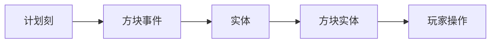

[TOC]

活塞（Piston）的基本用途是移动方块，而未激活的活塞本身又可以被其他活塞移动，这使得可以利用活塞来完成非常复杂的方块移动；而激活的活塞则激活的活塞则不能被移动，可以阻挡其他活塞移动方块。活塞的特性非常之多，我希望能以此篇文章完整地介绍并解释活塞的全部特性，并顺便聊一聊过去及未来的小改动。

### 活塞的组成

活塞在收回的状态是一个方块，但在伸出后占据了两个方块，它们是活塞的两个部分，我们把活塞没有移动的部分叫做活塞底座，或者我习惯叫作活塞屁股，而伸出的那部分方块被称作活塞头，也可以叫作活塞臂。没错，活塞就是一个屁股决定脑袋的红石元件。

#### 活塞底座

活塞底座是活塞的核心，它完全决定的活塞的运动，以下所有对于活塞特性的解释都是围绕活塞底座进行的，如不特殊说明，本文提到的活塞均指活塞的屁股而不是脑袋。

活塞屁股有伸出和收回两种状态，活塞在被激活时会伸出，变成伸出状态。单独存在的伸出状态活塞并不常见，因为当活塞伸出时通常也会伸出它的活塞头，收回时活塞头也随之消失，

【WIP】


#### 活塞头

【WIP】

### 自身状态检查

有三种情况下，活塞会检查自己的伸出状态，判断自己是否应该伸出或者收回：

- 被手动放置
- 受到方块更新
- 被放置
  - 包括由活塞移动导致的

无论是哪种情况下，都需要确保该运算是在服务端而不是客户端进行的。当活塞没有被成功推动时不会检查。

这三种情况可能在任意游戏阶段发生，活塞在任意阶段都可能会检查自身的伸出状态，并根据自身状态来决定是否要在运算方块事件的时候实际推出。

```java
//被手动放置
void setPlacedBy(level, blockPos, blockState, livingEntity, itemStack) {
    //非客户端
    if (!level.isClientSide) checkIfExtend(level, blockPos, blockState);
}

//受到更新
void neighborChanged(blockState, level, blockPos, block, blockPos2, bl) {
    //非客户端
    if (!level.isClientSide) checkIfExtend(level, blockPos, blockState);
}

//其他方式放置的方块，如推动
void onPlace(blockState, level, blockPos, blockState2, bl) {
    //如果方块没变则跳过
    if (blockState2.is(blockState.getBlock())) return;
    //非客户端且此处不为方块实体
    if (!level.isClientSide && level.getBlockEntity(blockPos) == null) checkIfExtend(level, blockPos, blockState);
}
```

#### 检查是否被激活

半连接性是活塞及发射器/投掷器所特有的一种激活方式，其内容是活塞上方一格被激活也可以激活该活塞，有时也可被称为上位激活。

首先先检查活塞自身位置的激活情况，需要排除推动方向上的激活，所以在活塞正前方放置一个红石块并不会让它推动。

检查完自身的5个激活位置后，检查活塞上方的激活位置，此处会检查包含活塞本身在内的六个位置。


这些位置存在指向活塞或活塞上部方块激活的红石元件都会使活塞激活。

可以注意到蓝色方块标记的位置并不是活塞直接毗邻的方块，这些位置的激活可能并不会更新到活塞，也就不会让活塞检查自身的状态，直至活塞被更新时才会响应，这也就是活塞的qc特性（Quasi-Connectivity，半连接性），激活与更新分开执行。当活塞处于一个激活状态与伸出状态不符合的情况下时，给活塞一个方块更新即可使其检查自身状态，我们将这样的活塞状态称为BUD态（Block Update Detector，方块更新探测器），可以用于响应并检测此处的方块更新。

与活塞类似，投掷器与发射器也有类似的上位激活的特性，同样，BUD也不是专指活塞上位激活这一特性，而是通常指在没有更新元件的时候激活这个元件，来达到等待一个更新才能激活的效果。而活塞正好拥有上位激活的特性，所以更容易出现BUD现象。

传统红石元件激活时会更新其二阶毗邻的方块位置，其卡顿也常被人所诟病，这是传统红石元件会充能实心方块导致，通过充能实心方块完成的激活不会更新到被激活方块，所以才需要更新二阶毗邻来通知元件被激活了。


这是一张红石粉激活更新的示意图，它激活了红色混凝土方块并会更新其毗邻（红色玻璃）及二阶毗邻（蓝色玻璃）的位置，上方活塞位于更新范围内且自检发现自己被激活，所以伸出。而下方活塞不在更新范围内，即使满足了上位激活也由于缺少更新而没有伸出。

```java
//检查是否被激活
boolean getNeighborSignal(level, blockPos, direction) {
    //朝各个方向检查激活情况
    for (direction2 : Direction.values()) {
        //不检查推出的方向
        if (direction2 == direction || !level.hasSignal(blockPos.relative(direction2), direction2)) continue;
        return true;
    }
    //如果此处有向上激活的信号则激活(?迷惑操作)
    if (level.hasSignal(blockPos, Direction.DOWN)) {
        return true;
    }
    //检查活塞上方的位置(引发qc特性的上位激活)
    blockPos2 = blockPos.above();
    //朝各个方向检查激活情况
    for (direction3 : Direction.values()) {
        //不检查下方
        if (direction3 == Direction.DOWN || !level.hasSignal(blockPos2.relative(direction3), direction3)) continue;
        return true;
    }
    return false;
}
```

#### 伸出or收回？

上一步中，活塞判断了自己是否被激活了，那么此时再检查自己的状态。

如果发现自己被激活了但没有伸出，那么它会想要伸出。在想要伸出之前，活塞会进行一次自检，判断自己能否伸出，它会建立一个用于分析推动结构的类来判断自己能否伸出，如果不行，那就此作罢，而如果经过一番分析发现是可行的，那就把这次推出添加至方块事件中，准备实际推出。

而如果它没有被激活，但伸出了，活塞就会打算收回。它会检查一格之外的位置，也就是活塞臂伸出正对的位置。如果它发现这个位置是自己刚刚推出还没有到位的方块，也就是它的推出动作还没有完成变受到了收回的信号，这便是所谓的活塞瞬推。伸出动作可能会因为受到阻碍无法完成，而拉回动作无论如何活塞臂都会收回，无论是收回还是瞬推收回的动作，它都会添加至方块事件中。

方块事件n参数标记了活塞动作类型，`n = 0`表示伸出动作，`n = 1`表示收回动作，`n = 2`表示瞬推收回动作。

```java
//检查是否需要伸出
//n = 0, 伸出
//n = 1, 收回
//n = 2, 瞬推收回
void checkIfExtend(level, blockPos, blockState) {
    //活塞的朝向
    direction = blockState.getValue(FACING);
    //检查激活情况
    bl = getNeighborSignal(level, blockPos, direction);
    //如果活塞会被激活而没有伸出
    if (bl && !blockState.getValue(EXTENDED).booleanValue()) {
        //分析方块结构检查能否伸出
        if (new PistonStructureResolver(level, blockPos, direction, true).resolve()) {
            //将本次伸出添加到方块事件
            level.blockEvent(blockPos, this, 0, direction.get3DDataValue());
        }
        //如果活塞没有被激活而伸出了
    } else if (!bl && blockState.getValue(EXTENDED).booleanValue()) {
        //伸出一格之外的位置,获取此处方块状态
        blockPos2 = blockPos.relative(direction, 2);
        blockState2 = level.getBlockState(blockPos2);
        n = 1;
        //如果这个方块是b36且朝向与当前活塞方向相同且为伸出的情况且伸出的进度不到一半
        //或在同一tick内
        //或正在处理该tick
        if (blockState2.is(Blocks.MOVING_PISTON) && blockState2.getValue(FACING) == direction && (blockEntity = level.getBlockEntity(blockPos2)) instanceof PistonMovingBlockEntity && (pistonMovingBlockEntity = (PistonMovingBlockEntity)blockEntity).isExtending() && (pistonMovingBlockEntity.getProgress(0.0f) < 0.5f || level.getGameTime() == pistonMovingBlockEntity.getLastTicked() || ((ServerLevel)level).isHandlingTick())) {
            //设置n
            n = 2;
        }
        //添加方块事件
        level.blockEvent(blockPos, this, n, direction.get3DDataValue());
    }
}
```

### 移动结构分析与优先级

游戏会使用一个叫做`PistonStructureResolver`的类来分析活塞的移动结构，统计活塞会推动或收回哪些方块，并限制活塞只能推动12个方块，不能推动一些推不动的方块，并顺便确定在移动过程中破坏哪些方块。

#### 方块的可移动性

对于单个方块，能否移动需要满足：

- 方块位于世界上下限及世界边境之内
- 不能是黑曜石、哭泣的黑曜石及重生锚
- 不能向世界下限之下及上限之上推动
- 不能推动伸出的活塞
- 方块能被挖掘
- 不能为阻碍移动的方块
  - 传送门、屏障、铁砧、砂轮、磁石、伸出的活塞头、活塞屁股正在移动的活塞
- 不能是方块实体

其中会被破坏的方块有：

- 压力板、床、钟、门、灯笼、潜影盒、结构空位、植物类、水/气泡柱、岩浆、雪片、火焰、蜘蛛网、竹子和笋、树叶、仙人掌、珊瑚、西瓜/南瓜、海蛋、蛋糕等许多装饰类方块

另外，带釉陶瓦是一类非常特殊的方块，它可以被推动但不能被拉动。

```java
//检查方块是否能够被活塞移动
//direction:推动方向
//direction2:活塞方向
//bl:
boolean isPushable(blockState, level, blockPos, direction, bl, direction2) {
    //如果该位置在世界之外,不能推动
    if (blockPos.getY() < 0 || blockPos.getY() > level.getMaxBuildHeight() - 1 || !level.getWorldBorder().isWithinBounds(blockPos)) {
        return false;
    }
    //如果该方块是空气,可以推动
    if (blockState.isAir()) {
        return true;
    }
    //如果该方块是黑曜石或哭泣的黑曜石或重生锚,不能推动
    if (blockState.is(Blocks.OBSIDIAN) || blockState.is(Blocks.CRYING_OBSIDIAN) || blockState.is(Blocks.RESPAWN_ANCHOR)) {
        return false;
    }
    //如果在y0向下,不能推动
    if (direction == Direction.DOWN && blockPos.getY() == 0) {
        return false;
    }
    //如果在世界顶部向上,不能推动
    if (direction == Direction.UP && blockPos.getY() == level.getMaxBuildHeight() - 1) {
        return false;
    }
    //如果该方块是伸出的活塞,不能伸出
    if (blockState.is(Blocks.PISTON) || blockState.is(Blocks.STICKY_PISTON)) {
        if (blockState.getValue(EXTENDED).booleanValue()) {
            return false;
        }
    } else {//该方块不是活塞
        //如果该方块无法挖掘,不能伸出
        if (blockState.getDestroySpeed(level, blockPos) == -1.0f) {
            return false;
        }
        //推动情况
        switch (blockState.getPistonPushReaction()) {
            //阻碍,不能推动
            case BLOCK: {
                return false;
            }
            //破坏,返回bl
            case DESTROY: {
                return bl;
            }
            //仅推动,如果是推动则可以
            case PUSH_ONLY: {
                return direction == direction2;
            }
        }
    }
    //如果是方块实体,不能推动
    return !blockState.getBlock().isEntityBlock();
}
```

#### 移动结构分析

活塞移动方块可以是普通活塞推动方块或粘性活塞拉动方块，其中被推动方块的前方可以推动别的方块，而粘液块和蜂蜜块可以粘住侧面和后面的方块，这使得一个活塞可以移动排列成某些形状的多个方块，但无论排列成什么样，一个活塞都只能移动12个方块，这是它的移动上限。

游戏分析移动结构的方法是先选择一个移动位点，从这个移动位点按移动轴方向的单列直线方块结构分析正向推动及可粘方块反向拉动的方块，然后从这些移动方块中寻找侧面粘连的方块，再从粘连方块作为移动位点开始下一轮直线方块结构的分析，直至结束。

将起始点作为最开始的移动位点，这一点是会被活塞直接推动或拉动的。如果该点方块不能被活塞移动，那么活塞就放弃移动了；但是如果该方块可被活塞破坏，而活塞恰好要推出，那么将该方块添加至破坏列表中，结束移动结构分析。

分析完直线方块结构后，会遍历移动方块列表中所有的方块，若其为可粘方块，则检查它的侧面是否会粘动其他方块来添加分支，加入新的直线移动结构。在这一过程中，正在遍历的移动方块列表也会随之增加。

```java
//分析移动结构
boolean resolve() {
    //清空列表
    toPush.clear();
    toDestroy.clear();
    //如果起始点不能移动
    blockState = level.getBlockState(startPos);
    if (!PistonBaseBlock.isPushable(blockState, level, startPos, pushDirection, false, pistonDirection)) {
        //推动可破坏
        if (extending && blockState.getPistonPushReaction() == PushReaction.DESTROY) {
            //添加至破坏方块列表中
            toDestroy.add(startPos);
            //移动完成
            return true;
        }
        //移动失败
        return false;
    }
    //无法添加直线方块结构，则移动失败
    if (!addBlockLine(startPos, pushDirection)) return false;
    //对于每个推动方块列表中的方块
    for (int i = 0; i < toPush.size(); ++i) {
        blockPos = toPush.get(i);
        //如果是可粘方块，则尝试添加分支
        if (PistonStructureResolver.isSticky(level.getBlockState(blockPos).getBlock())) continue;
            if(!addBranchingBlocks(blockPos)) return false;
    }
    return true;
}
```

##### 直线方块结构

直线方块结构是一列沿着移动轴方向的方块，这一列方块中有一个移动位点，它可能是被活塞直接移动的，也可能是被可粘方块直接带动的方块。这个方块作为这一直线结构移动的动力点，推动前方的方块，若可粘则拉动后方方块。

若这个移动位点是空气、无法移动、活塞自身或已经包含在移动方块列表中，那么说明这列结构的移动位点不会从侧面粘动，也就不需要分析这列方块了。

而如果移动位点加上移动方块列表已经超过了活塞的移动上限12个方块，那么移动位点阻碍了这次移动，整个结构无法移动。

先从可粘方块拉动后方方块开始分析，从移动位点沿着移动方向的反向寻找可粘方块直线拉动中断的位置。从移动位点至第一个空气、与此粘块不互粘的、无法移动的方块或是活塞本身的一列方块便是粘块拉动的部分。判断拉动部分加上已有的移动方块列表之和是否超过活塞移动上限12，若超过，整个结构无法移动。

确定了拉动部分后，将它们添加到移动方块列表中。添加顺序为移动方向的反向，最后方的方块先添加进列表。

再分析推动前方方块的部分。从移动位点开始向移动方向寻找会被推动方块。当该方块已经位于移动方块列表中时，说明这个该直线结构已经结束，再往前是另一直线方块结构，而在推动时可粘会与该结构发生碰撞，所以需要重新排列移动方块列表的顺序。对于已经走完的这些方块，如果是可粘方块，则进入分支方块结构检查，寻找侧面粘动的方块。如果侧面粘动使拉动失败，逐级返回失败结果。

重排会交换拉动结构与推动结构的顺序。

【WIP：重排了啥】

如果正向推动的前方为空气，那也就意味着该直线结构的结束。

如果正向推动的前方为不可移动的方块或活塞本身，那么无法移动，逐级返回失败结果。

如果该方块可以被移动破坏，那么将它添加到破坏方块列表中。

检查加上移动方块列表是否已经超过推动上限12，如果没有，则将该方块添加到移动方块列表中。

```java
//添加一列方块
boolean addBlockLine(blockPos, direction) {
    int n;
    //获取该方块
    blockState = level.getBlockState(blockPos);
    block = blockState.getBlock();
    //如果是空气
    if (blockState.isAir()) return true;
    //该方块不可被移动
    if (!PistonBaseBlock.isPushable(blockState, level, blockPos, pushDirection, false, direction)) return true;
    //为活塞自身的位置
    if (blockPos.equals(pistonPos)) return true;
    //移动方块列表已包含该位置
    if (toPush.contains(blockPos)) return true;
    //方块计数
    int n2 = 1;
    //移动列表+1大于12
    if (n2 + toPush.size() > 12) return false;
    //该方块可粘
    while (PistonStructureResolver.isSticky(block)) {
        //移动方向往前一个位置
        blockPos2 = blockPos.relative(pushDirection.getOpposite(), n2);
        //换为这个方块
        block2 = block;
        blockState = level.getBlockState(blockPos2);
        block = blockState.getBlock();
        //该方块是空气或这两个方块不互粘或该方块或原先那个方块不可推动或该位置为活塞本身，退出循环
        if (blockState.isAir() || !PistonStructureResolver.canStickToEachOther(block2, block) || !PistonBaseBlock.isPushable(blockState, level, blockPos2, pushDirection, false, pushDirection.getOpposite()) || blockPos2.equals(pistonPos)) break;
        //如果加上该方块没有超过推动上限，继续循环
        if (++n2 + toPush.size() <= 12) continue;
        //移动失败
        return false;
    }
    int n3 = 0;
    for (n = n2 - 1; n >= 0; --n) {
        //把方块反向n2-1格添加到移动方块列表中
        toPush.add(blockPos.relative(pushDirection.getOpposite(), n));
        ++n3;
    }
    n = 1;
    do {
        //如果该方块正向n格存在与方块移动列表中 n4位置
        if ((n4 = toPush.indexOf(blockPos3 = blockPos.relative(pushDirection, n))) > -1) {
            //n3、n4重排列表
            reorderListAtCollision(n3, n4);
            //对于所有方块
            for (int i = 0; i <= n4 + n3; ++i) {
                blockPos4 = toPush.get(i);
                //如果不是可粘方块或成功添加分支方块则继续
                if (!PistonStructureResolver.isSticky(level.getBlockState(blockPos4).getBlock()) || addBranchingBlocks(blockPos4)) continue;
                return false;
            }
            return true;
        }
        blockState = level.getBlockState(blockPos3);
        //是空气，添加完成
        if (blockState.isAir()) return true;
        //不可移动或为活塞自身
        if (!PistonBaseBlock.isPushable(blockState, level, blockPos3, pushDirection, true, pushDirection) || blockPos3.equals(pistonPos)) return false;
        //该方块会被破坏
        if (blockState.getPistonPushReaction() == PushReaction.DESTROY) {
            //添加方块至破坏列表
            toDestroy.add(blockPos3);
            //添加完成
            return true;
        }
        //推动列表大于12，添加失败
        if (toPush.size() >= 12) return false;
        //添加该方块
        toPush.add(blockPos3);
        ++n3;
        ++n;
    } while (true);
}
```

##### 添加分支

游戏会检查这个方块的六个方向来查找它所粘动的方块，顺序由方向枚举类型确定，定义顺序为：下、上、北、南、西、东。

这里会排除与移动方向同轴的两个方向，只检查会被粘住的侧面。侧面的这个方块如果会与该方块互粘，那么尝试将继续以它开始直线方块结构分析。如果直线方块结构分析移动失败，那么会逐级返回失败结果。

```java
//添加分支方块
private boolean addBranchingBlocks(blockPos) {
    blockState = level.getBlockState(blockPos);
    //对于每个方向
    for (direction : Direction.values()) {
        //同轴移动或该方块与移动方块方块不互粘或能添加方块列，继续循环
        if (direction.getAxis() == pushDirection.getAxis() || !PistonStructureResolver.canStickToEachOther((blockState2 = level.getBlockState(blockPos2 = blockPos.relative(direction))).getBlock(), blockState.getBlock()) || addBlockLine(blockPos2, direction)) continue;
        return false;
    }
    return true;
}
```

#### 方块列表与移动顺序

根据对移动结构的分析顺序，我们可以总结出添加方块至方块列表中有以下顺序规则：

- 直线方块结构沿移动方向由后至前
- 添加分支方向顺序为：下上北南西东
- 分支为递归添加，越近的分支越早添加至方块列表

这就是活塞推动或拉动方块的移动顺序吗？并不，恰恰相反。

在移动方块的时候，游戏会根据该方块列表**逆序**移动方块，所以实际的方块移动顺序与以上顺序是刚好相反的，所以移动方块顺序规则为：

- 移动方向越前越先移动
- 分支按照“东西南北上下”的顺序移动
- 越远的分支越先移动

### 方块事件

上面提到，当活塞经过自检，发现需要或伸出或收回时会添加至方块事件中，到了游戏运算方块事件的阶段，才会判断实际推动或拉回方块的情况。

在运算方块事件的时候，活塞首先会再次检查自身的状态，如果被激活而方块事件为收回或瞬推收回，那么它会重新伸出并结束该方块事件。同样，如果活塞没有被激活而方块事件为推出，它也会直接结束这一方块事件。

#### 伸出事件

如果这是一个伸出事件，那么活塞就会尝试移动前方方块，如果成功就将自己设置成伸出状态并播放活塞伸出的音效。

#### 收回事件&瞬推收回事件

收回和瞬推收回事件会相对更复杂一些。瞬推是活塞的一种性质，而不是单独一种方块事件，它由正常的推出事件及瞬推收回事件组成，瞬推收回事件会在推出动作没有完成的时候运算，强制停止活塞的推出，跳过b36方块实体的部分运算。只要推出动作没有完全执行完毕的时候给出瞬推信号，活塞就会表现出一次瞬推，这一现象包含了普通活塞和粘性活塞，由于包含b36完整执行一次活塞伸出需要3gt，所以0gt、1gt和2gt的推出事件与瞬推收回事件间隔都可以使活塞出现瞬推。

如果此时的活塞头是正在移动中的方块，也就是b36，对应了活塞的瞬推收回事件，此时会使这个活塞头位置的方块**强制到位**，来为之后的操作腾出空间。活塞本身也就是活塞屁股会被设置成b36并给出方块更新及形状更新。

##### 粘性活塞瞬间到位特性

如果这个活塞是粘性的话，瞬推收回事件会使活塞正前方推出的b36方块结束运算，直接变成普通方块，这也就是粘性活塞瞬推的的瞬间到位特性，而不在这个位置的方块不会瞬间到位，依然进行b36运算。

粘性活塞这一方块瞬间到位的特性可以使得方块在同一游戏刻内移动多格成为可能，经典应用有0s关门的活塞门或方块瞬间传送一类的科技。方块传送器：[BV1gV411f7Y9](https://www.bilibili.com/video/BV1gV411f7Y9)。0t瞬推的应用范围非常广，而且可以有非常多方式来创建一个可以使活塞0t瞬推的信号。有关0t瞬推的讲解可以参考[av52246363](https://www.bilibili.com/video/av52246363/)、[av59074251](https://www.bilibili.com/video/av59074251/)、[av62003916](https://www.bilibili.com/video/av62003916/)

同时移动的方块拥有不同的属性也可以用于粘液块的重组，所有方块被移动的时候都会变成b36方块实体，它们不能被移动且也不会像粘液块一样可以粘连其他方块。但是对于被粘性活塞直接瞬推推动的粘液块来说，它变回普通方块的时间要早于其他被粘连的粘液块。在此存在差异之时拉走提前到位的粘液块并不会粘连其他粘液块，因为其他粘液块此时还是b36，不会与之粘连。

如图所示，这就完成了一次粘液块结构的拆解。瞬推后第一个方块瞬间到位后的拆解可以使用推或拉，使用粘性活塞或普通活塞都可以，但需要保证这一移动的方块事件需要在瞬推收回的方块事件之后，否则活塞无法移动还没有到位的b36。


另外，有趣的一点是，收回或是瞬推收回不会沿用先前自检时得出的结论，而会重新检查推出后的方块位置是否为b36。它需要检查的条件有：

- 伸出一格外位置为b36方块
- 伸出一格外位置为b36方块实体
- 该b36方块实体的朝向与当前活塞的朝向相同
- 该b36方块实体被推出而不是收回

##### 粘性活塞正常收回

如果不是上述瞬推的情况，活塞会检查最初添加的方块事件类型，如果满足这些条件

- 类型为收回
- 前方一格之外不为空气
- 该方块能被拉动
- 该方块会被正常推动或为活塞/粘性活塞

那么活塞会尝试拉回面向的方块。

如果不满足，它只会移除面前的方块，也就是活塞臂的位置。

##### 普通活塞收回

直接移除活塞臂位置的方块。

最后，无论是粘性活塞还是活塞，播放活塞收回的声音。

```java
//执行方块事件
//n = 0, 推出
//n = 1, 收回
//n = 2, 瞬推收回
boolean triggerEvent(blockState, level, blockPos, n, n2) {
    //活塞方向
    direction = blockState.getValue(FACING);
    //非客户端
    if (!level.isClientSide) {
        //检查激活情况
        bl = getNeighborSignal(level, blockPos, direction);
        //如果被激活,而方块事件为需要收回或瞬推
        if (bl && (n == 1 || n == 2)) {
            //将活塞设置成推出状态
            level.setBlock(blockPos, blockState.setValue(EXTENDED, true), 2);
            return false;
        }
        //如果没有激活,方块事件为推出,则取消该方块事件
        if (!bl && n == 0) return false;
    }
    //推出事件
    if (n == 0) {
        //移动前方方块
        if (!moveBlocks(level, blockPos, direction, true)) return false;
        //将活塞设置为推出状态
        level.setBlock(blockPos, blockState.setValue(EXTENDED, true), 67);
        //播放活塞推出的声音
        level.playSound(null, blockPos, SoundEvents.PISTON_EXTEND, SoundSource.BLOCKS, 0.5f, level.random.nextFloat() * 0.25f + 0.6f);
        return true;
    } else {
        //其他方块事件(?) 返回
        if (n != 1 && n != 2) return true;
        //收回或瞬推收回事件
        //活塞头位置的方块实体
        blockEntity = level.getBlockEntity(blockPos.relative(direction));
        //如果是b36,则将其变回普通方块
        if (blockEntity instanceof PistonMovingBlockEntity) {
            ((PistonMovingBlockEntity)blockEntity).finalTick();
        }
        //将活塞设置成b36
        blockState2 = (Blocks.MOVING_PISTON.defaultBlockState().setValue(MovingPistonBlock.FACING, direction)).setValue(MovingPistonBlock.TYPE, isSticky ? PistonType.STICKY : PistonType.DEFAULT);
        level.setBlock(blockPos, blockState2, 20);
        //将该位置设置成b36方块实体
        level.setBlockEntity(blockPos, MovingPistonBlock.newMovingBlockEntity(defaultBlockState().setValue(FACING, Direction.from3DDataValue(n2 & 7)), direction, false, true));
        //给该位置一个方块更新
        level.blockUpdated(blockPos, blockState2.getBlock());
        //给该位置一个形状更新
        blockState2.updateNeighbourShapes(level, blockPos, 2);
        //如果是粘性活塞
        if (isSticky) {
            //推出方向一格之外的位置
            blockPos2 = blockPos.offset(direction.getStepX() * 2, direction.getStepY() * 2, direction.getStepZ() * 2);
            blockState3 = level.getBlockState(blockPos2);
            bl = false;
            //如果这个方块是b36且方向为该活塞推出方向且处于推出状态(瞬推收回)
            if (blockState3.is(Blocks.MOVING_PISTON) && (blockEntity2 = level.getBlockEntity(blockPos2)) instanceof PistonMovingBlockEntity && (pistonMovingBlockEntity = (PistonMovingBlockEntity)blockEntity2).getDirection() == direction && pistonMovingBlockEntity.isExtending()) {
                //将其变回普通方块
                pistonMovingBlockEntity.finalTick();
                bl = true;
            }
            //如果不是上面的情况(正常收回)
            if (!bl) {
                //如果是收回事件且该方块不是空气且活塞可以拉动且该方块能被正常移动或该方块是活塞/粘性活塞
                if (n == 1 && !blockState3.isAir() && PistonBaseBlock.isPushable(blockState3, level, blockPos2, direction.getOpposite(), false, direction) && (blockState3.getPistonPushReaction() == PushReaction.NORMAL || blockState3.is(Blocks.PISTON) || blockState3.is(Blocks.STICKY_PISTON))) {
                    //拉动前方方块
                    moveBlocks(level, blockPos, direction, false);
                } else {//前方方块没有方块被拉动
                    //删除活塞臂位置的方块
                    level.removeBlock(blockPos.relative(direction), false);
                }
            }
        } else {//是普通活塞
            //删除活塞臂位置的方块
            level.removeBlock(blockPos.relative(direction), false);
        }
        //播放活塞收回的声音
        level.playSound(null, blockPos, SoundEvents.PISTON_CONTRACT, SoundSource.BLOCKS, 0.5f, level.random.nextFloat() * 0.15f + 0.6f);
    }
    return true;
}
```

#### 瞬间到位

在上述分析中，我们提到活塞会使几个位置的b36方块瞬间到位，而无需等待方块实体运算。出现瞬间到位的情况有：

- 收回事件 活塞头位置的方块为b36
- 收回事件 粘性活塞伸出方向一格外为b36 且b36为同方向推出

这些瞬间到位的特性都是在活塞收回的时候才会出现。我们分别来看这两种情况：

##### 活塞头位置瞬间到位

这个活塞不限于普通活塞或粘性活塞，这使得活塞

活塞头的位置强制到位，当它为普通活塞或者是没有拉动方块的粘性活塞，也就是强制到位变成空气，你可以向完成瞬推的活塞臂处推进别的方块或放置方块。所以面对一个0t推出的活塞放置方块并不会使点击到活塞臂，放下方块0t激活活塞的同一游戏刻内推出变回空气，使玩家不会点击到方块，所以会有一种的丝滑感。

【WIP：可能有错】

#### 移动方块

现在开始准备移动方块。

如果是打算收回方块，那么会先将当前活塞头的位置设为空气来为后面的方块移动腾出空间。

在正式移动之前，会再次分析移动结构，如果发现有阻碍无法就会结束这个函数，不会移动方块。

首先，会创建一个哈希表，这个哈希的作用是保存方块移动前的位置，以便在移动后删除原位置的方块。

根据分析的移动结构，可以获取到一个移动方块的列表和一个破坏方块的列表。先将移动方块列表中的所有方块添加至列表及哈希表中。

活塞会先破坏方块，根据移动结构分析得到的破坏方块列表**逆序**依次破坏方块。设置方块为空气来删除方块。然后将这些方块添加到列表中。此处设置方块不产生状态更新，但产生方块更新。

然后移动方块，根据移动结构分析得到的移动方块**逆序**移动方块。因为分析活塞推动时是由近到远，而移动方块需要先移动的方块不能覆盖到未移动的方块上，所以在这里需要逆序使得移动方向较前的先移动。实际方块移动顺序如前所述。活塞会在待移动方块沿移动方向的前一格创建该方块对应的b36。此处设置方块不产生方块更新，但产生状态更新。

破坏并移动完所有方块后，如果是活塞伸出事件，需要将活塞头伸出，将活塞头的位置设置成粘性活塞或普通活塞对应的活塞头b36。并从哈希表中移除这个位置。此处设置方块不产生方块更新，但产生状态更新。

此时将哈希表中没有移除的方块位置全部设置成空气。然后给这些方块状态更新。

接下来会是破坏方块列表给出的更新，给出状态更新和方块更新。

最后给出更新的是活塞头，不过只会在伸出状态时给出更新，如果粘性活塞正常收回时，活塞头位置的方块由移动的方块给出，但若不能正常收回，此处既不会给出方块更新，也不会给出状态更新，那么可以利用这一不更新特性制作浮空水、浮空告示牌等。


```java
//bl = true, 推出
//bl = false, 收回
boolean moveBlocks(level, blockPos, direction, bl) {
    //活塞头的位置
    blockPos2 = blockPos.relative(direction);
    //如果是收回且活塞头的位置是活塞头
    if (!bl && level.getBlockState(blockPos2).is(Blocks.PISTON_HEAD)) {
        //将活塞头的位置设为空气
        level.setBlock(blockPos2, Blocks.AIR.defaultBlockState(), 20);
    }
    //分析移动结构,如果不能移动就不移动
    if (!(pistonStructureResolver = new PistonStructureResolver(level, blockPos, direction, bl)).resolve()) {
        return false;
    }
    hashMap = Maps.newHashMap();
    //创建移动方块列表
    list = pistonStructureResolver.getToPush();
    arrayList = Lists.newArrayList();
    //移动方块列表中的所有方块
    for (int i = 0; i < list.size(); ++i) {
        arrblockState = list.get(i);
        object2 = level.getBlockState((BlockPos)arrblockState);
        //添加到列表中
        arrayList.add(object2);
        //添加到哈希表中
        hashMap.put(arrblockState, object2);
    }
    //创建破坏方块列表
    list2 = pistonStructureResolver.getToDestroy();
    //创建一个移动方块+破坏方块的列表
    arrblockState = new BlockState[list.size() + list2.size()];
    //确定移动方向
    object2 = bl ? direction : direction.getOpposite();
    int n3 = 0;
    //破坏方块列表 从后到前
    for (n = list2.size() - 1; n >= 0; --n) {
        object3 = list2.get(n);
        object22 = level.getBlockState((BlockPos)object3);
        object = object22.getBlock().isEntityBlock() ? level.getBlockEntity((BlockPos)object3) : null;
        //掉落方块实体的物品
        PistonBaseBlock.dropResources(object22, level, (BlockPos)object3, (BlockEntity)object);
        //将该方块设置成空气
        level.setBlock((BlockPos)object3, Blocks.AIR.defaultBlockState(), 18);//添加到列表中
        arrblockState[n3++] = object22;
    }
    //移动方块列表 从后到前
    for (n = list.size() - 1; n >= 0; --n) {
        object3 = list.get(n);
        blockState = level.getBlockState((BlockPos)object3);
        //移动目的地的方块
        object3 = ((BlockPos)object3).relative((Direction)object2);
        //删除哈希表中方块
        hashMap.remove(object3);
        //将该方块设置成b36
        level.setBlock((BlockPos)object3, Blocks.MOVING_PISTON.defaultBlockState().setValue(FACING, direction), 68);
        //将该方块设置成b36方块实体
        level.setBlockEntity((BlockPos)object3, MovingPistonBlock.newMovingBlockEntity(arrayList.get(n), direction, bl, false));
        //添加到列表中
        arrblockState[n3++] = blockState;
    }
    //如果是推出
    if (bl) {
        //准备活塞头b36
        pistonType = isSticky ? PistonType.STICKY : PistonType.DEFAULT;
        object3 = (Blocks.PISTON_HEAD.defaultBlockState().setValue(PistonHeadBlock.FACING, direction)).setValue(PistonHeadBlock.TYPE, pistonType);
        blockState = (Blocks.MOVING_PISTON.defaultBlockState().setValue(MovingPistonBlock.FACING, direction)).setValue(MovingPistonBlock.TYPE, isSticky ? PistonType.STICKY : PistonType.DEFAULT);
        //从哈希表中删除
        hashMap.remove(blockPos2);
        //将活塞头的位置设置成b36
        level.setBlock(blockPos2, blockState, 68);
        //将活塞头的位置设置成b36方块实体
        level.setBlockEntity(blockPos2, MovingPistonBlock.newMovingBlockEntity(object3, direction, true, true));
    }
    blockState = Blocks.AIR.defaultBlockState();
    //对于哈希表中剩下的方块位置
    for (blockPos3 : hashMap.keySet()) {
        //设置成空气
        level.setBlock(blockPos3, blockState, 82);
    }
    //对于哈希表中的所有方块
    for (entry : hashMap.entrySet()) {
        object = (BlockPos)entry.getKey();
        blockState2 = entry.getValue();
        //给出间接形状更新(自身)
        blockState2.updateIndirectNeighbourShapes(level, (BlockPos)object, 2);
        blockState.updateNeighbourShapes(level, (BlockPos)object, 2);
        //给出间接形状更新(空气)
        blockState.updateIndirectNeighbourShapes(level, (BlockPos)object, 2);
    }
    n3 = 0;
    //对于破坏方块列表中的所有方块
    for (n2 = list2.size() - 1; n2 >= 0; --n2) {
        blockState3 = arrblockState[n3++];
        object = list2.get(n2);
        //给出间接形状更新(自身)
        blockState3.updateIndirectNeighbourShapes(level, (BlockPos)object, 2);
        //给出方块更新
        level.updateNeighborsAt((BlockPos)object, blockState3.getBlock());/
    }
    //对于移动方块列表中的所有方块
    for (n2 = list.size() - 1; n2 >= 0; --n2) {
        //给出方块更新
        level.updateNeighborsAt(list.get(n2), arrblockState[n3++].getBlock());
    }
    //如果是推出
    if (bl) {
        //活塞头给出方块更新
        level.updateNeighborsAt(blockPos2, Blocks.PISTON_HEAD);
    }
    return true;
}
```

### b36移动中的方块

正如上所说，活塞移动方块并不是一步到位改变方块位置，而是通过创建一个b36方块来移动。并使用一个b36方块实体在每个游戏刻内运算，直至消失，计时移动的过程，完成移动后将其变会普通方块。这个方块与方块实体一般都是同时出现同时消失，但也可以通过方块实体移除的技术来创建无方块实体的b36方块（TE-less b36）。参考视频：[av27672502](https://www.bilibili.com/video/av27672502)、[BV18K41157mE](https://www.bilibili.com/video/BV18K41157mE)

在每个游戏刻内运算方块实体时，b36方块实体会检查自己是否推动完成，若推动完成，则会将移动中的方块变会普通方块。将当前方块实体标记为移除，等待世界运算将其移除。若它保存的方块状态没有问题且该位置确实为b36方块时，它会开始固化这个b36方块。

首先，先给这个位置一个状态更新，然后检查这个需要变回的方块是否为空气，也就是活塞臂收回时创建的b36，如果是，那么变回空气更新该位置。若不是空气，游戏会检查该方块是否为含水方块，若是含水方块，则清除它的含水状态。这就是为什么活塞推动含水方块时会丢失其中的水。然后在该位置上放置要移动的方块，并给出方块更新及状态更新。

如果还没有完成移动的话，将进度增加0.5。我们可以计算一下从开始移动到完成移动所需的时间。

1. BE: 开始推动，创建b36

   TE: 进度+0.5 移动实体

2. TE: 进度+0.5 移动实体

3. TE: 发现进度已达到1，变回方块

移动从第1gt的BE开始，到第3gt的TE结束。如果需要被再次移动，那么需要等待到第4gt的BE。通常认为活塞推动需要3gt的时间。而对于瞬推来说，将b36变回普通方块是在方块事件中完成的，在同游戏刻内还能被继续移动。0t瞬推的含义是在0t后能被再次移动，1gt瞬推在1gt后能继续移动，而2gt瞬推为2gt。

b36在移动的过程中，还会移动与它碰撞或者被蜜块粘住的实体。有关实体的运算，在此处不加以赘述，有一个关于旧版本活塞与实体交互的视频可以了解一下：[BV1tx41117TX](https://www.bilibili.com/video/BV1tx41117TX)

```java
//运算方块实体
void tick() {
    //记录当前gt
    lastTicked = level.getGameTime();
    progressO = progress;
    //如果已经推动完成
    if (progressO >= 1.0f) {
        //如果是客户端且deathTicks没有超过5
        if (level.isClientSide && deathTicks < 5) {
            //增加deathTicks计数并返回
            ++deathTicks;
            return;
        }
        //移除方块实体
        level.removeBlockEntity(worldPosition);
        setRemoved();
        //如果存在方块状态且该方块为b36
        if (movedState != null && level.getBlockState(worldPosition).is(Blocks.MOVING_PISTON)) {
            //给出形状更新
            blockState = Block.updateFromNeighbourShapes(movedState, level, worldPosition);
            //如果为空气
            if (blockState.isAir()) {
                //设置为对应的方块
                level.setBlock(worldPosition, movedState, 84);
                //更新或破坏该方块
                Block.updateOrDestroy(movedState, blockState, level, worldPosition, 3);
            } else {//不为空气
                //如果为含水方块
                if (blockState.hasProperty(BlockStateProperties.WATERLOGGED) && blockState.getValue(BlockStateProperties.WATERLOGGED).booleanValue()) {
                    //移除含水方块中的水
                    blockState = (BlockState)blockState.setValue(BlockStateProperties.WATERLOGGED, false);
                }
                //设置方块
                level.setBlock(worldPosition, blockState, 67);
                //给出方块更新
                level.neighborChanged(worldPosition, blockState.getBlock(), worldPosition);
            }
        }
        return;
    }//推动未完成
    //推动进度+0.5
    float f = progress + 0.5f;
    //移动碰撞影响的实体
    moveCollidedEntities(f);
    //移动粘住的实体
    moveStuckEntities(f);
    progress = f;
    //如果推动进度>=1,取为1
    if (progress >= 1.0f) {
        progress = 1.0f;
    }
}
```

但是在瞬推中，b36方块实体的运算会在方块事件中执行，这会强制使该方块变回普通方块，缩减3gt的移动时间。

将进度直接快进到完成，然后将此方块实体标记为移除。如果该方块为活塞臂，移动完成则变成空气，否则将其变成对应的方块。到位后，给出方块更新。

瞬推到位不仅减少了移动时间，还缩水了一些判断，不，没有缩水，瞬推不会清除含水方块中的水。

另外，瞬推到位也不进行实体移动运算，实体移动运算只会在方块实体运算中进行，对于0t瞬推，没有进行过实体移动运算，实体完全不会因b36移动而卡进方块中，而1gt瞬推，进行了1次实体移动运算，会使实体一半卡进方块中，2gt瞬推与正常3gt移动同样进行了2次实体移动运算，所以不会使实体卡进方块里。

```java
//直接进入到该方块实体的最后一次运算,将b36方块实体变回普通方块
void finalTick() {
    //存在世界且进度未满或客户端运算
    if (level != null && (progressO < 1.0f || level.isClientSide)) {
        //将进度设为完成
        progressO = progress = 1.0f;
        //移除方块实体
        level.removeBlockEntity(worldPosition);
        setRemoved();
        //如果此处为b36方块
        if (level.getBlockState(worldPosition).is(Blocks.MOVING_PISTON)) {
            //为活塞b36则为空气,否则给出形状更新
            blockState = isSourcePiston ? Blocks.AIR.defaultBlockState() : Block.updateFromNeighbourShapes(movedState, level, worldPosition);
            //设置方块
            level.setBlock(worldPosition, blockState, 3);
            //给出方块更新
            level.neighborChanged(worldPosition, blockState.getBlock(), worldPosition);
        }
    }
}
```

### 方块更新与形状更新

活塞受到更新时并不会直接执行动作，而是在方块事件中出现的

【WIP】

### 活塞与物品复制

一些物品可以通过使用活塞推拉特定的方块结构来完成复制，推拉结构中的方块没有掉落但是却出现了掉落物。通常，可以使用活塞来进行复制的物品有铁轨、地毯以及点燃的TNT。

【WIP】

### 延迟理论

由于活塞的伸出是在方块事件运算时执行的，而更新活塞导致的活塞自检在任意游戏阶段都有可能发生，方块事件这种延后执行的性质可能会使得延迟到下一游戏刻内执行，产生额外的延迟。

在一个游戏刻内，游戏会按照一定的顺序进行运算，可以粗略地将该顺序表示为：



在一个游戏刻内，运算方块事件只排在了计划刻之后。在计划刻及方块事件中更新活塞添加的方块事件会在同一游戏刻内运算，而通过实体、方块实体及玩家操作更新活塞则会延后至下一游戏刻的方块事件阶段运行。这也就是所谓的“活塞不同步BUG”，典型特征即为拉杆直接激活活塞会比中继器激活活塞多一个游戏刻延迟。


如图所示，上下两组活塞理应拥有相同的延迟差，但是下方两个活塞同时推出，而上面两个活塞不同时推出，这可以通过游戏阶段分析解释原因。中继器二档拥有4gt延迟，活塞正常推出拥有3gt延迟，而下面的活塞由玩家操作直接激活，该活塞更新并自检后会在下一游戏刻的方块事件阶段才运算，在此处多出的1gt使得它们同时推出。而上方激活并更新活塞的信号由中继器给出，计划刻运算早于方块事件运算，可以在同一游戏刻内完成，所以不会有额外的延迟。

这一延迟在即为启动延迟理论中的活塞启动延迟，而在即时更新理论中上下两种输入，中继器及拉杆，被分别称作不同步输入和同步输入，并探讨了各类元器件的同步情况。而根据此处所描述的原理，结合各类元器件的激活与更新方式，我们可以很轻易得分析出在什么活塞会拥有这一延迟，这也就是[Gamepiaynmo](https://space.bilibili.com/9434241)的[红石更新延迟理论](https://tieba.baidu.com/p/4078230299)所分析的方法。

即时更新理论：[BV1Gt411i7sb][https://www.bilibili.com/video/BV1Gt411i7sb]

### 方块事件不同步

由于方块事件并不是瞬间运算的，所以在添加方块事件到该执行方块事件之间对该活塞做出一些更改，出现活塞自检与活塞实际动作不同步的情况，我将以两个实例来说明不同步的情况。

#### 推动上限树干检测

在添加方块事件之前及运算方块事件时，各进行一次移动结构分析，前一次移动结构分析只用于判断是否添加至方块事件中运算，而后一次移动结构分析则能得出活塞实际推动与破坏的方块。因此，如果更新时活塞不能推出，那么活塞不会在方块事件中分析移动结构。即使可以推出也不会推出。

当向上的活塞受到更新并激活时，侧面的活塞已经将一个推动完成的方块插入到下方活塞推动于泥土之间，向上推出的活塞分析推出结构时包含了检查树干是否长出，如果树干长出，活塞认为无法推动，不会在方块事件运算时做任何事情；而如果树干未长出，活塞认为可以推动，添加至方块事件列表中。到了运算方块事件的阶段，由于计划刻元件的优先级，上方活塞拉回的方块事件排在下方活塞的推出事件之前，在下方活塞推出的时候，其上方为已经变成了空气，所以不会推动泥土不影响树木生长。

#### 铁头功破基岩

方块事件系统使用先进先出（FIFO）的结构记录方块坐标、方块类型以及两个方块事件的参数。

在运算一个方块事件之前，游戏会检查这个位置的方块是否还是之前的那个方块，如果这个方块变成了其他方块或者被破坏，那么这个对应的方块事件也不会运算。但是，由于方块事件只记录了方块坐标及类型，只会该坐标的方块是否与记录的方块类型相符，但不检查具体的方块状态是否相同，所以，只要方块类型相同，即使该方块的状态发生了变化，改变了方向，该方块事件依然会被执行。

运算方块事件需要的参数中虽然接受了一个方块状态，但是由于添加方块事件时并没有记录当时的方块状态，此方块状态为即时获取的，也就是更新后的活塞方向。破基岩便使用了这一原理改变方块事件中计划收回的活塞朝向来让它朝向基岩收回。活塞收回的动作在前面已经说明，会直接删除活塞臂处的方块。

那么，只需要控制好这些事件执行的顺序就行了。TNT爆炸在实体运算阶段执行，破坏激活活塞的信号源并更新活塞，添加了一个活塞收回事件准备在下一游戏刻中执行，然后，爆炸破坏了活塞，将此处变成可放置的空气。玩家使用连点器在同游戏刻的玩家操作阶段放置了一个向下的活塞，它会在下一游戏刻中的方块事件运算中收回。对于这一破基岩原理的动画讲解可以参考：[BV1vJ41157sr][https://www.bilibili.com/video/BV1vJ41157sr]

另外，还有一个小细节，运算方块事件还会使用两个参数，对于活塞方块事件来说，一个是伸出/收回类型，另一个是活塞朝向。不用担心，此处的朝向参数并没有参与活塞动作及移动方块的判断，而是用于创建活塞屁股的b36方块实体。在铁头功破基岩中，我们使用一个朝下的活塞替换了朝上的收回活塞，虽然玩家放置的活塞“继承”了收回的方块事件尝试朝下方收回，但是创建活塞屁股的b36方块实体时候依然使用了向上的朝向，所以一次成功的铁头功之后，留下的活塞应该依然是朝上的。


既然铁头功破基岩使用的是活塞方块事件的特性，那么理应适用与粘性活塞与普通活塞，那么，根据活塞收回删除方块以及方块事件检查的知识，判断以下铁头功的示意图中哪些是可以成功破基岩。展示框中有粘液球的表示手持粘性活塞。


### 无头活塞

可以发现，这个位置的b36不一定要求是这个活塞产生的，我们可以引入无头活塞来制作一个不是那么寻常的方块瞬间到位。无头活塞方块与伸出的活塞屁股拥有相同的。我们可以来分析一个无头活塞产生0t的结构：


当左侧活塞推动粘液块的时候，会更新右侧的无头活塞，无头活塞经过自检发现自己没有被激活却处于伸出状态，于是添加了想要收回的方块事件。在方块事件阶段，粘液块带动的玻璃块正是这一收回事件的活塞前方的b36，而且方向与活塞一致且为推出，所以这一粘性无头活塞会使这一玻璃快瞬间到位。盔甲架没有移动证实了该方块是被0t瞬推的。如果把推粘液块改成拉粘液块或将粘性无头活塞改成普通无头活塞，这一0t瞬推都不会成功。

同样以无头活塞作示例，能拉回方块的情况下没有删除该末地传送门框架，而不能拉回方块的情况下删除了末地传送门框架。


【WIP】