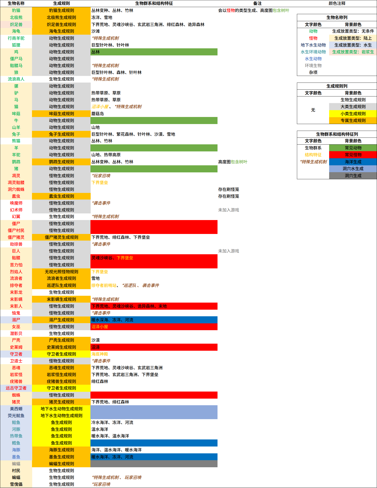

TODO：

- `checkSpawnObstruction`没写
- 猪灵及僵尸猪灵需要光照等级大于11
- 如何合理地串起来

 > 写文章时最新的稳定版游戏版本：1.17（指Minecraft Java版，不保证向前及向后的版本兼容性

生物生成可以发生在很多情况下，例如在前文中介绍的成群生成。除此之外，在世界地形初次生成或刷怪笼等游戏机制之下也会使生物生成，在这些情况下，生物也会遵循一定的生成规律，也就是本文所要详细介绍的生成条件。本文所介绍的生成条件针对某种或某类生物，而不是指代特定生成机制中要求的条件，实际的生物生成情况应结合生成机制考虑。

Minecraft中所有生物的生成相关条件被列在下表中：

[^表格文档]: [生物生成条件表](生物生成条件表.xlsx)

### 生物类别

游戏中的生物被分成了七大类，在加载范围内对各类别生物分别计数。在成群生成的游戏机制中，会根据生物类别确定生物上限系数，若当前生物数量已超过该上限，则不再执行该类别的成群生成。生物只有在数量未超过该类别的生物上限时才能进行成群生成。该生物上限不会影响成群生成之外的生成机制，但其他机制中生成的生物依然会根据生物类别进行计数。

以下是各生物类别的上限系数：

怪物：`70`	动物：`10`	环境生物：`15` 地下水生动物：`5` 水生动物：`5`	水生环境生物：`20`	杂项：`-1`

### 生成放置类型

生成放置类型表示该种生物生成位置的大致情况，分成了四种情况：陆上、水生、岩浆生以及无条件。

生成放置类型的判断会在所有生成机制中使用。（成群生成、随世界生成、僵尸增援、刷猫、流浪商人、袭击）

#### 陆上生成放置类型

需要生成位置满足：

1. 下方方块需要为可生成方块

2. 选中方块及其上方为空方块

   其中，空方块的定义为：

   1. 不能有完整碰撞箱
   2. 不能提供红石信号
   3. 不能是流体
   4. 不能是不允许生成在其中的方块（铁轨）
   5. 不能对生物造成伤害

选中方块的下方方块为可生成方块，该方块是否可生成由方块属性定义，并根据生物种类决定。可生成方块需要满足：

1. 上表面完整
2. 发光等级小于14
3. 特例：
   1. 基岩、屏障、玻璃及染色和遮光玻璃、活板门为不可生成方块
   2. 灵魂沙、雕刻的南瓜、南瓜灯、红石灯为可生成方块
   3. 冰和霜冰上仅可生成北极熊
   4. 树叶上仅可生成豹猫与鹦鹉
   5. 岩浆块上仅可生成免疫火焰伤害的生物

#### 水生生成放置类型

需要生成位置满足：

1. 选中方块为水或含水方块
2. 下方方块为水或含水方块
3. 岩浆生生成放置类型

需要生成位置满足：

1. 选中方块为岩浆

目前，能在岩浆中生成的生物只有炽足兽。

#### 无条件生成放置类型

此类别的生物生成无需满足生成放置类型。

这些生物多数不会自然生成，而有另外的特殊生成机制。例如：唤魔师、卫道士和劫掠兽在袭击事件中生成；行商羊驼和流浪商人为单独的游戏机制等。

但除此之外，狐狸和熊猫为无条件生成放置类型却会自然成群生成。

### 高度图类型

高度图类型判断一般用于**伴随世界生成**的自然生成。区分为是否将树叶计算进高度图中。

通常，随着世界生成，动物会自然生成于地表。一般生物会生成于y轴中除树叶外最高的方块上，而有两种生物会自然生成于树叶之上：鹦鹉和豹猫。

### 生成规则

除生成机制本身，在生成过程中可以对生成条件做更细致的限制的即为生成规则。这些生成规则会在除召唤外任何类型的生成中使用。对于生物能否生成，它给出的并不是一定的是否结论，也会结合当前的条件确定成功生成的概率。

- 自然生成（成群生成及伴随世界生成）
- 刷怪笼
- 僵尸增援
- 铁傀儡生成

#### 生物生成规则

要求方块下方为可生成方块。

这是最基础的生成规则，也是要求最少的生成规则。使用该规则的通常是一些拥有特殊生成机制的生物，如：末影龙、铁傀儡、雪傀儡、村民、幻翼、潜影贝和流浪商人。

#### 怪物生成规则

- 不为和平模式
- 并拥有足够低的光照等级，同时检查基础的生物生成规则
- 光照等级检查，当前光照等级小于等于0-31的随机整数
- 若不为雷雨天，天空光与方块光的光照等级的较大值小于等于0-7的随机整数
- 若为雷雨天，天空光-10与方块光的光照等级的较大值小于等于0-7的随机整数
- 满足生物生成规则

#### 无视光照等级怪物生成规则

- 不为和平模式
- 满足生物生成规则

#### 动物生成规则

动物生成需要满足下方方块为草方块且光照等级大于8。

#### 地下水生动物生成规则

- 低于海平面
- 位于地下
- 方块光光照等级为0
- 天空光光照等级为0，若雷暴则小于等于10
- 下方五格方块内存在基础石头，该基础石头与生成位置中没有除了水之外的方块
  - 基础石头包含石头、安山岩、闪长岩、凝灰岩和深板岩

#### 鱼生成规则

鱼生成需要当前方块为水方块且上方方块也为水方块。

#### 守卫者生成规则

- 若当前位置露天则生成成功的概率为1/20
  - 透明方块与不完整的不含水方块无法遮光
- 不为和平模式
- 除刷怪笼外，当前方块为水方块

#### 海豚生成规则

- Y大于45且低于海平面
- 群系需为海洋或深海
- 当前方块是水

#### 溺尸生成规则

- 不为和平模式
- 光照等级可刷怪
- 除刷怪笼外，当前方块为水方块
- 河流、冻河群系中的生成概率为1/15
- 海洋群系中的生成概率为1/40且低于海平面5格以上

#### 墨鱼生成规则

- Y大于45且低于海平面

#### 蝙蝠生成规则

- Y低于海平面
- 若为万圣节
  - 光照等级大于0-6之间的随机值
- 若不为万圣节
  - 1/2的概率失败
  - 光照等级大于0-3之间的随机值
- 满足生物生成规则

#### 末影螨生成规则

- 满足无视光照等级怪物生成规则
- 5格内没有玩家

#### 恶魂生成规则

- 不为和平模式
- 生成成功的概率为1/20
- 满足生物生成条件

#### 尸壳生成规则

- 满足怪物生成条件
- 除刷怪笼外，必须露天

#### 岩浆怪生成规则

- 不为和平模式

#### 哞菇生成规则

- 下方方块为菌丝
- 光照等级大于8

#### 豹猫生成规则

- 生成成功的概率为2/3

#### 鹦鹉生成规则

- 下方方块为树叶、草方块、原木或空气
- 光照等级大于8

#### 疣猪兽生成规则

- 下方方块不为下界疣块

#### 猪灵生成规则

- 下方方块不为下界疣块

#### 巡逻队生成规则

- 光照等级不大于8
- 满足无视光照等级怪物生成规则

#### 北极熊生成规则

- 若群系为冻洋或封冻深海
  - 光照等级大于8
  - 下方方块为冰
- 满足动物生成条件

#### 兔子生成规则

- 下方方块为草方块、雪或沙子
- 光照等级大于8

#### 蠹虫生成规则

- 满足无视光照等级怪物生成规则
- 5格内没有玩家

#### 史莱姆生成规则

- 不为和平模式
- 若群系为沼泽
  - Y大于50小于70
  - 生成成功概率1/2*月光光照等级
  - 光照等级小于等于0-7随机值
  - 满足生物生成规则
- （不随世界生成）在史莱姆区块内
  - 生成成功概率为1/10
  - Y小于40
  - 满足生物生成规则

#### 流浪者生成规则

- 满足怪物生成规则
- 除刷怪笼外，露天

#### 炽足兽生成规则

- 所在岩浆的最上方为空气

#### 海龟生成规则

- Y小于海平面+5
- 下方方块为沙子
- 光照等级大于8

#### 僵尸猪灵生成规则

- 不为和平模式
- 下方方块不为下界疣块
